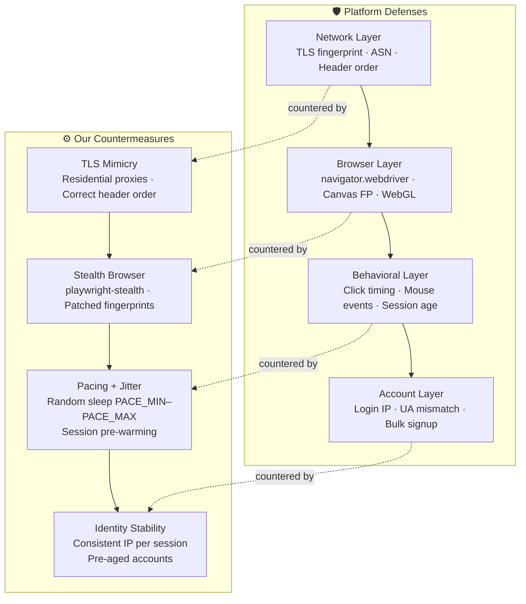
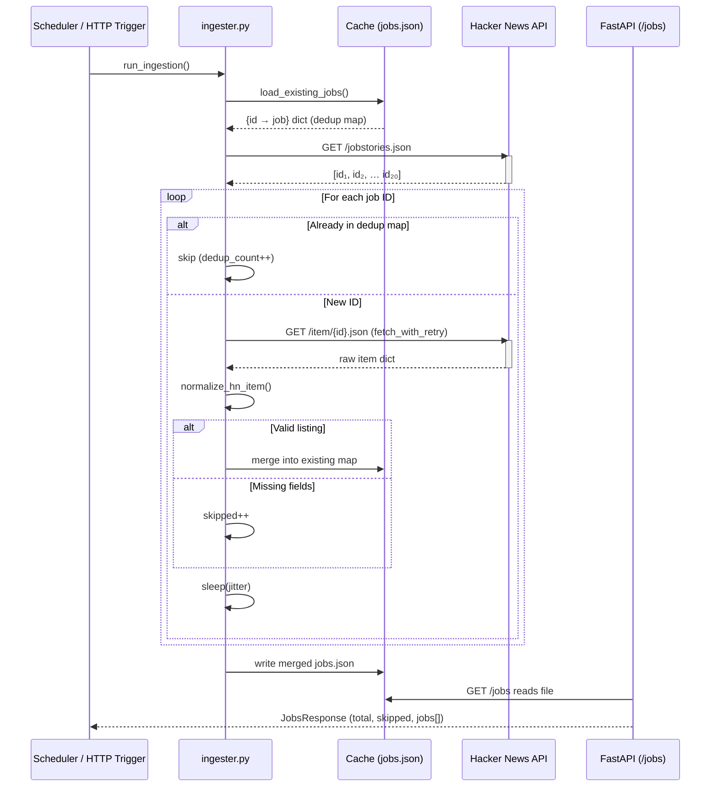

# Part 1: Getting Data Out of a Platform That Doesn't Want You To

This is the design document for the ingestion pipeline. It covers the four areas the assessment asks about: what gets you caught, how the ingestion strategy is structured, how the system stays alive under adversity, and where we drew the ethical line.

---

## 1. Detection Surface

Modern job boards like LinkedIn and Indeed defend their data using layered detection that operates at the network, browser, and behavioral level simultaneously. Understanding which layer catches you — and why — is what separates a scraper that lasts three minutes from one that runs for weeks.

**Network-level signals** are the first filter. Standard Python HTTP clients like `requests` produce TLS handshakes with fingerprints (JA3 or JA4 hashes) that are widely catalogued and blocklisted. An `Accept` header that simply says `*/*`, missing `Sec-Fetch-*` headers, or headers arriving in an order no browser would ever produce — any one of these is enough to trigger a Cloudflare or DataDome challenge before a single HTML byte is served.

**Browser-level signals** catch the next tier of tooling. Headless Chrome instances expose `navigator.webdriver = true`, a missing `plugins` array, a consistent and implausible canvas fingerprint, and a WebGL renderer string that no real GPU would produce. Libraries like `playwright-stealth` and `undetected-chromedriver` patch many of these tells, but the patches need to stay current with each Chrome release because fingerprinting libraries track them.

**Behavioral signals** are the hardest to fake at scale. Real users scroll before clicking, take seconds to move between elements, visit unrelated pages, and let tabs sit idle. A bot that clicks the next listing within 200ms of page load, never touches CSS or image assets, and never triggers mouse-move events looks nothing like a person — even if it passed every network and browser check.

**Account and session signals** apply when you need authenticated data. Multiple logins from a single IP, session tokens used across mismatched user agents, and accounts created in bulk from the same subnet all trigger account-level flags that outlast any single IP block.

---

## 2. Ingestion Strategy

The strategy is built around identity stability rather than volume. The goal is to look like one consistent, plausible user rather than many cheap ones.

**Session pre-warming** means each identity (IP + cookie set + user-agent) is used to perform realistic browsing before touching any data endpoints: load the homepage, scroll, follow a few links. Only after this warm-up phase does the pipeline make targeted requests. This means the session has behavioural history by the time it does anything interesting.

**Residential proxy rotation** is the infrastructure backbone. Datacenter IPs are trivially identified by ASN. Rotating residential proxies are pooled and assigned per identity — the same IP is used consistently within a session, never swapped mid-flow, because sudden geographic jumps are a strong signal.

**Pacing with jitter** is implemented directly in `ingester.py`. Each request sleeps a random interval between `PACE_MIN` and `PACE_MAX` seconds. A fixed sleep value is itself a detection signal; jitter removes the periodicity that distinguishes polling from browsing.

**Plan B: mobile API interception.** Web-based bot detection focuses on HTTP/browser fingerprints. Many platforms expose their data through a mobile app that talks to a separate API — one that often has lighter bot detection and returns clean JSON directly. In a controlled environment, intercepting mobile app traffic (via a proxy with SSL bump, after certificate pinning is bypassed) can yield the same data with far less defensive surface to navigate.

**Exponential backoff on 429s** is the pipeline's first line of resilience. A 429 response is not a failure — it is information. The system backs off, optionally rotates to a fresher identity, and waits before retrying.

---

## 3. Resilience

**DOM mutation** is the most common failure mode for scraper pipelines in production. A site redesign that moves the job title from a `<h1>` to a `
` silently breaks every XPath or CSS selector that targeted the old structure. The solution is to move away from brittle positional selectors toward semantic extraction: look for text that *looks like* a job title using heuristics (presence of role keywords, placement near salary or location text) or a lightweight LLM call that extracts structured schema from raw HTML regardless of the exact markup.

**Rate limit handling** in `ingester.py` uses exponential backoff with jitter on any 429 or 5xx response, up to `MAX_RETRIES` attempts. On a real target, a 429 also triggers a proxy rotation and session cool-down before the retry.

**Empty or honeypot responses** require sanity-checking every payload before writing it. If a response contains unexpectedly few results, or if field names suddenly change shape, the pipeline should raise an alert rather than silently write empty data. The normalized `JobListing` dataclass in `ingester.py` acts as a lightweight schema validation layer — items that fail normalization are counted as `skipped` rather than crashing the run.

**Markup change detection** is an operational concern: the pipeline should log a diff when the shape of incoming data changes between runs, so an engineer sees it before the database fills up with malformed records.

---

## 4. Where We Stop

We scrape only publicly visible data — job listings that any unauthenticated visitor can see in their browser. We do not scrape profile data, private messages, connection graphs, or anything behind an authentication wall we did not legitimately obtain.

We limit request concurrency deliberately so that the target service does not experience meaningful load from our pipeline. This is not altruism; it is also how you avoid looking like a DDoS and triggering infrastructure-level countermeasures rather than application-level ones.

We stop entirely when a platform makes its legal position explicit through cease-and-desist communications or clearly enumerated terms that prohibit automated access to the specific data we are collecting. The grey area is real and acknowledged; we operate within it by targeting only public data at low velocity, and we exit cleanly when the legal risk becomes concrete.

CAPTCHA solving via third-party services sits at the edge of our boundary. Automated CAPTCHA solving is technically feasible but signals an intent to override an explicit friction mechanism. For this project, we note it as a capability and do not implement it in the demo.

---

## 5. Architecture

### Detection Layers vs. Our Countermeasures

---

### Ingestion Pipeline — End-to-End Flow

